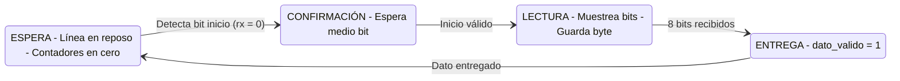
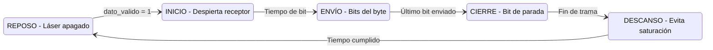

#  Enlace Óptico Visible Li-Fi con Basys 3

##  Descripción general

Este proyecto consiste en la implementación de un enlace de comunicaciones ópticas de corto alcance utilizando luz visible (Li-Fi) mediante la tarjeta de desarrollo Basys 3. El sistema permite la transmisión y recepción de mensajes digitales empleando un LED o láser de alta intensidad como medio de transmisión, sin el uso de radiofrecuencia.

La Basys 3 actúa como transmisor y receptor del sistema. En el transmisor, los datos son enviados desde un computador personal a través de una interfaz UART, codificados en formato ASCII y modulados mediante la técnica On-Off Keying (OOK), controlando el encendido y apagado del emisor luminoso. La información se transmite a través del espacio libre hacia el receptor óptico.

En el receptor, un fotodiodo o fototransistor junto con un circuito de acondicionamiento convierte la señal luminosa recibida en una señal digital compatible con la FPGA. Posteriormente, la Basys 3 realiza la sincronización, demodulación y reconstrucción de los datos para recuperar el mensaje original, el cual se visualiza mediante LEDs, displays de siete segmentos o una interfaz gráfica.

---

##  Objetivo del proyecto

Diseñar e implementar un sistema de comunicación óptica basado en luz visible que permita transmitir y recibir mensajes digitales utilizando la tarjeta Basys 3 y técnicas básicas de modulación digital.

---

##  Características principales

- Comunicación óptica por luz visible (Li-Fi).
- Modulación digital On-Off Keying (OOK).
- Implementación en VHDL.
- Comunicación UART entre PC y FPGA.
- Transmisión y recepción de caracteres ASCII.
- Visualización del mensaje recibido.

---

##  Arquitectura del sistema

El sistema se divide en los siguientes bloques:

- Interfaz UART (PC ↔ Basys 3)
- Codificador y decodificador de datos
- Modulador y demodulador OOK
- Enlace óptico (LED/Láser y fotodetector)
- Visualización del mensaje recibido

---

```mermaid
graph LR
    A[PC Emisor] -->|UART TX| B[Basys 3<br/>UART RX]
    B -->|ASCII| C[Codificador]
    C -->|Bits| D[Modulador OOK]
    D -->|Luz Visible| E[LED / Láser]

    E -->|Canal Óptico| F[Fotodiodo / Fototransistor]
    F -->|Señal Digital| G[Basys 3<br/>Demodulador OOK]
    G -->|Bits| H[Decodificador]
    H -->|ASCII| I[UART TX]
    I -->|UART RX| J[PC Receptor]

    style B fill:#cce5ff,stroke:#333,stroke-width:1.5px
    style G fill:#cce5ff,stroke:#333,stroke-width:1.5px
    style E fill:#ffe6cc,stroke:#333,stroke-width:1.5px
    style F fill:#ffe6cc,stroke:#333,stroke-width:1.5px
```

# 🔁 Máquina de Estados del Transmisor Li-Fi

## 📥 Recepción de Datos – UART RX (Basys 3)
Cuando el usuario envía un carácter desde la PC mediante un programa en Python, este dato viaja por el enlace UART hacia la tarjeta Basys 3.  
El módulo UART RX escucha la línea serial, reconstruye el byte recibido y notifica que el dato es válido.  
La máquina de estados es circular y siempre regresa a su estado inicial.

Máquina de estados UART RX (Mermaid):

```mermaid
stateDiagram-v2
    direction LR
    IDLE --> START : Detecta bit inicio (rx = 0)
    START --> DATOS : Inicio válido
    DATOS --> STOP : 8 bits recibidos
    STOP --> IDLE : Dato entregado

    IDLE : ESPERA - Línea en reposo - Contadores en cero
    START : CONFIRMACIÓN - Espera medio bit
    DATOS : LECTURA - Muestrea bits - Guarda byte
    STOP : ENTREGA - dato_valido = 1
```

## 🧠 Codificación del Dato – Codificador Li-Fi
Cuando el UART indica que el dato es válido, el byte pasa al codificador.  
Este bloque define el protocolo de transmisión óptica: inicio, datos, parada y pausa de seguridad.  
La máquina de estados también es circular y vuelve al estado de espera.

Máquina de estados Codificador (Mermaid):

```mermaid

stateDiagram-v2
    direction LR
    ESPERA --> START : dato_valido = 1
    START --> DATOS : Tiempo de bit
    DATOS --> STOP : Último bit enviado
    STOP --> PAUSA : Fin de trama
    PAUSA --> ESPERA : Tiempo cumplido

    ESPERA : REPOSO - Láser apagado
    START : INICIO - Despierta receptor
    DATOS : ENVÍO - Bits del byte
    STOP : CIERRE - Bit de parada
    PAUSA : DESCANSO - Evita saturación
```

## 💡 Modulación Óptica – Modulador OOK
El modulador es la etapa física del sistema y no utiliza una máquina de estados.  
Convierte directamente los bits digitales en luz visible.

Funcionamiento:
- Genera una portadora (por ejemplo 38 kHz)
- Controla el láser mediante lógica digital
- Bit = 0 → láser activo (portadora encendida)
- Bit = 1 → láser apagado

El modulador ejecuta directamente lo que ordena el codificador y el sistema completo siempre regresa al estado de reposo, listo para una nueva transmisión.

---
### Máquina de estados del receptor
(diagrama FSM + explicación)

##  Tecnologías utilizadas

- Tarjeta de desarrollo **Basys 3**
- Lenguaje **VHDL**
- Comunicación **UART**
- Modulación **OOK**
- Fotodiodo o fototransistor
- **Python** 

