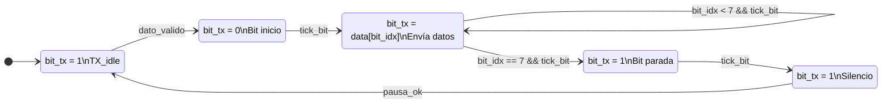

#  Enlace Óptico Visible Li-Fi con Basys 3

##  Descripción general

Este proyecto consiste en la implementación de un enlace de comunicaciones ópticas de corto alcance utilizando luz visible (Li-Fi) mediante la tarjeta de desarrollo Basys 3. El sistema permite la transmisión y recepción de mensajes digitales empleando un LED o láser de alta intensidad como medio de transmisión, sin el uso de radiofrecuencia.

La Basys 3 actúa como transmisor y receptor del sistema. En el transmisor, los datos son enviados desde un computador personal a través de una interfaz UART, codificados en formato ASCII y modulados mediante la técnica On-Off Keying (OOK), controlando el encendido y apagado del emisor luminoso. La información se transmite a través del espacio libre hacia el receptor óptico.

En el receptor, un fotodiodo o fototransistor junto con un circuito de acondicionamiento convierte la señal luminosa recibida en una señal digital compatible con la FPGA. Posteriormente, la Basys 3 realiza la sincronización, demodulación y reconstrucción de los datos para recuperar el mensaje original, el cual se visualiza mediante LEDs, displays de siete segmentos o una interfaz gráfica.

---

##  Objetivo del proyecto

Diseñar e implementar un sistema de comunicación óptica basado en luz visible que permita transmitir y recibir mensajes digitales utilizando la tarjeta Basys 3 y técnicas básicas de modulación digital.

---

##  Características principales

- Comunicación óptica por luz visible (Li-Fi).
- Modulación digital On-Off Keying (OOK).
- Implementación en VHDL.
- Comunicación UART entre PC y FPGA.
- Transmisión y recepción de caracteres ASCII.
- Visualización del mensaje recibido.

---

##  Arquitectura del sistema

El sistema se divide en los siguientes bloques:

- Interfaz UART (PC ↔ Basys 3)
- Codificador y decodificador de datos
- Modulador y demodulador OOK
- Enlace óptico (LED/Láser y fotodetector)
- Visualización del mensaje recibido

---

## Funcionamiento del sistema
### Máquina de estados del transmisor

---
### Máquina de estados del receptor
(diagrama FSM + explicación)

##  Tecnologías utilizadas

- Tarjeta de desarrollo **Basys 3**
- Lenguaje **VHDL**
- Comunicación **UART**
- Modulación **OOK**
- Fotodiodo o fototransistor
- **Python** 

